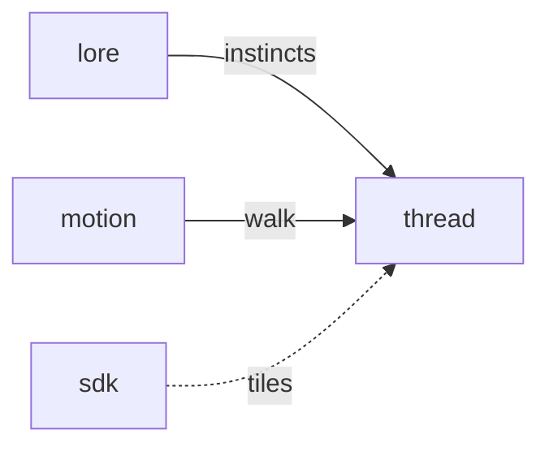

# Thread

**Pet Maze Escape** — Puzzle: guide a lost pet home. You shape the maze; their AI walks it.

Part of [ComputerPets](https://github.com/RicheyWorks/computerpets). Map: [computerpets-ecosystem](https://github.com/RicheyWorks/computerpets-ecosystem).

| | |
| --- | --- |
| Status | Design scaffold — loop and engine frozen |
| License | MIT |
| Tokens | Minigames never mint or burn. Tired overlay, not a dead lineage. |
| First pet | [Meet Rui first](https://github.com/RicheyWorks/computerpets/blob/main/docs/START-HERE.md). This game is optional. |

## The loop

Named after the mythic thread, not a stolen maze engine. Species instincts matter: frogs cut water tiles, pandas hug trees. You never possess the body — you are the architect.

## Who plays

Puzzle architects. You place tiles; the pet walks.

## What it is not

A possession sim. Not a fork of Daedalus2 (sibling, not a dependency).

## Genre and engine

- Genre: **Pathfinding puzzle**
- Engine: **Godot**
- Stack: Godot 4 · A* / flow fields · you paint walls, pet instincts bias the path
- Default surface: `Godot editor`

## Architecture



## How you play

1. Daily maze seed.
2. Place 8 tiles. Pet autowalks.
3. Exit before patience ends.
4. Par = treat. Fail = pet still home on overlay, just annoyed.

## First slice

Build this and stop.

**Daily maze, 8 tiles, Rui autowalk, par time = treat.**

You know it works when: No path: hint. AI loop: timeout. Custom tiles cannot seal the exit.

## Environment

Godot 4

## Failure doctrine

No path → hint, not a freeze. AI loop → timeout and reset. Custom tiles cannot block exit permanently.

Canon rules that never yield:

- 210 living kinds. No illegal hybrids.
- Overlay pets can get tired, sick, or hide. Tokens are not burned by a minigame.
- Desktop walk stays the main quest. Closing Thread must leave Rui walking.

## Neighbors

- computerpets-lore
- computerpets-motion
- computerpets-sdk (custom tiles)
- computerpets (Daedalus2 is a sibling, not a dependency)

## Layout

```
computerpets-thread/
  README.md
  LICENSE
  docs/DESIGN.md
  src/                implementation lands here
```

## Run (Windows)

```powershell
godot --path . ; F5
```

Meet Rui first via the [flagship start-here](https://github.com/RicheyWorks/computerpets/blob/main/docs/START-HERE.md). This game is optional.

## Links

- Flagship: [RicheyWorks/computerpets](https://github.com/RicheyWorks/computerpets)
- This repo: [RicheyWorks/computerpets-thread](https://github.com/RicheyWorks/computerpets-thread)
- Map: [RicheyWorks/computerpets-ecosystem](https://github.com/RicheyWorks/computerpets-ecosystem)
- Design file: [docs/DESIGN.md](docs/DESIGN.md)

## License

MIT. See [LICENSE](LICENSE).

---

*Two hundred ten living kinds. Keep them so a line does not go quiet.*
